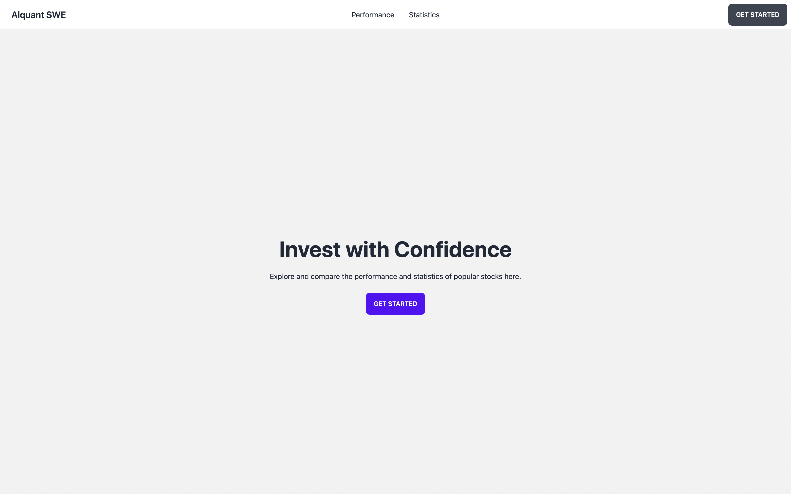
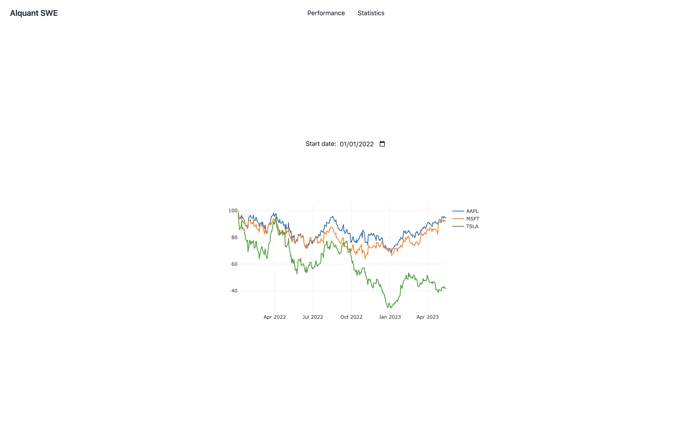
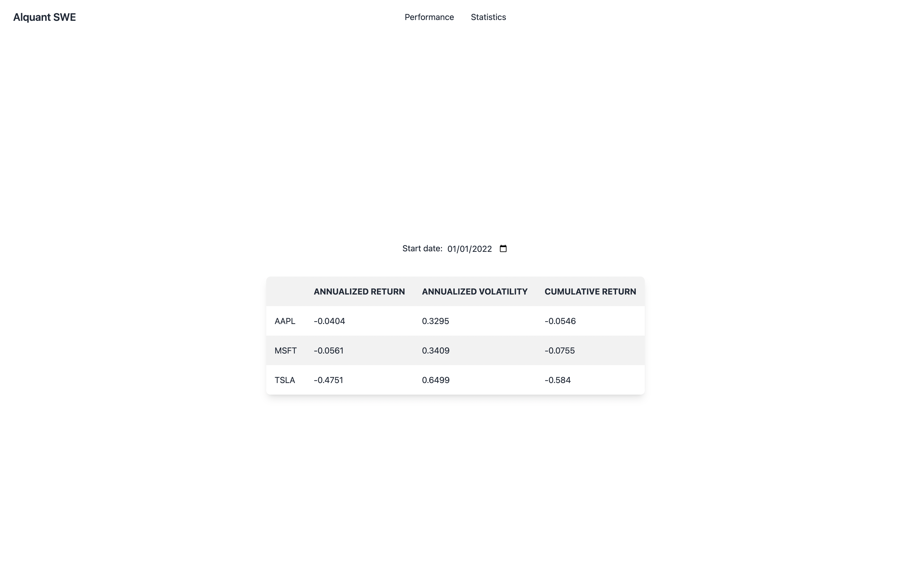

# Alquant SWE: Take-Home Exercise

## Overview

This is a single-page web application that allows users to compare the performance and statistics of popular stocks. The application is built using Vue.js for the frontend, Python and Flask for the backend, and is deployed on AWS Lambda. For simplicity, the backend directly serves the static assets.

You can try out the live demo [here](https://4rns0lo2j0.execute-api.eu-central-1.amazonaws.com/). The demo includes features such as a performance graph and a statistics table that displays cumulative return, annualized return, and annualized volatility for selected stocks.

## Features

- Performance graph
- Stock statistics (cumulative return, annualized return, annualized volatility)

## API Endpoints

### Performance Endpoint

- **URL:** `/stocks/performance`
- **Method:** `GET`
- **URL Params:** 
  - `start=[date in YYYY-MM-DD format]`
- **Success Response:**
  - **Code:** 200
  - **Content:** 
    - **Schema:**
      ```markdown
      {
        "stocks": {
          "<stock_symbol>": [number, ...],
          ...
        },
        "timestamps": [string (date in YYYY-MM-DD format), ...]
      }
      ```
    - **Example:**
      ```json
      {
        "stocks": {
          "AAPL": [100.0,100.10947363682816,99.42959769053881,99.14151287431773,99.14151287431773],
          "MSFT": [100.0,99.29556779346504,98.93055093849054,99.08744320521443,99.81748668672965],
          "TSLA": [100.0,102.10039675207057,99.66773609772072,98.70061275076758,98.80147793156577]
        },
        "timestamps": ["2023-05-10","2023-05-11","2023-05-12","2023-05-15","2023-05-16"]
      }
      ```
- **Sample Call:** [try it here](https://4rns0lo2j0.execute-api.eu-central-1.amazonaws.com/stocks/performance?start=2020-01-01)

### Statistics Endpoint

- **URL:** `/stocks/statistics`
- **Method:** `GET`
- **URL Params:** 
  - `start=[date in YYYY-MM-DD format]`
- **Success Response:**
  - **Code:** 200
  - **Content:** 
    - **Schema:**
      ```markdown
      {
        "<stock_symbol>": {
          "annualized_return": number,
          "annualized_volatility": number,
          "cumulative_return": number
        },
        ...
      }
      ```
    - **Example:**
      ```json
      {
        "AAPL": {
          "annualized_return": 0.2791,
          "annualized_volatility": 0.3571,
          "cumulative_return": 1.2916
        },
        "MSFT": {
          "annualized_return": 0.2175,
          "annualized_volatility": 0.3426,
          "cumulative_return": 0.9409
        },
        "TSLA": {
          "annualized_return": 0.6855,
          "annualized_volatility": 0.7122,
          "cumulative_return": 4.8053
        }
      }
      ```
- **Sample Call:** [try it here](https://4rns0lo2j0.execute-api.eu-central-1.amazonaws.com/stocks/statistics?start=2020-01-01)

## Screenshots

Below are some screenshots of the application:

**Home Page**



**Performance Page**



**Statistics Page**



## Dependencies

To run this project, you'll need the following:

- Python 3.9+
- NPM
- [Poetry](https://python-poetry.org/docs/#installing-with-the-official-installer)
- [Serverless](https://www.serverless.com/framework/docs/getting-started) (optional: for deployment)

## Setup

Follow these steps to get the project up and running:

### Building static assets

```bash
cd client/
npm install
npm run build
```

### Running locally

```bash
cd server/
poetry install
poetry shell
flask --app server/app.py run --debug
```

Alternative, if you have serverless installed:

```bash
cd server/
poetry install
npm install
poetry shell
sls wsgi serve
```

### Deploying on AWS Lambda:

```bash
cd server/
sls deploy
```

## Contact

If you have any questions, feel free to reach out at <abdelghani.nassim@gmail.com>
